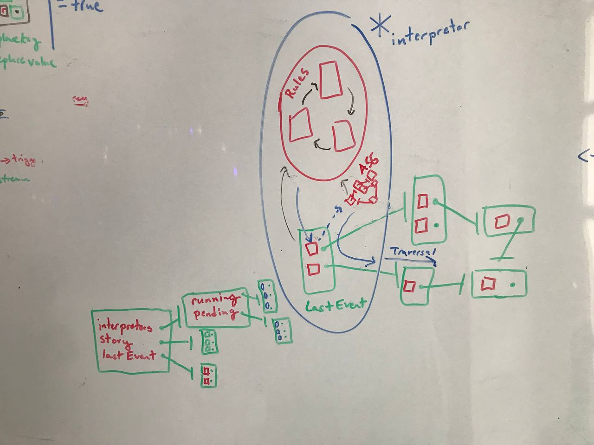

# Play!

**Play!** is a new media, it is an **interfacing interface**.

**Music** has at its disposal duration of time.

**Painting** can present to the viewer the whole content of its message at one moment.

**Movie** attempted a synthesis of **music** and **painting** but lacked in *mutability* and *extensiveness*, *receptivity* and *interactivity*.

Indeed for what the **movie** itself lacked in *receptivity* and *mutability* it demanded of the viewer, and the injunction of this medium can be summarized as ***Watch!***

**Interface** partially inverted the **movie-viewer** relation adding *mutability, extensiveness, receptivity* and *interactivity* to the thing in view.

**Social-interface** brought *sociality* to the *mutability, extensiveness, receptivity,* and *interactivity* of the **interface** in ways defined by the affordances of the particular **interface**.

**Interfacing interface** brings *mutability*, *extensiveness*, *interactivity*, *receptivity* to the architecture/frame of **interface** itself through **interface** itself. The injunction of this medium is ***Play!***

*(Add note on a language as interfacing interfacing)*

---

**[Play! (telegram)](https://t.me/semioverse)**

---

**Play!** is an interface for navigating and transforming the Semioverse (a semiotic computing/programming environment). Players can connect, communicate, and engage in independent yet interoperable games. It functions as a symbol system where symbols are not just being used but continuously created and redefined.

Each game represents a semiotic domain, a self-contained yet interoperable universe of meaning. Here, Game and Play serve as base classes for creating, interacting with, and sharing semioverses.

The Play class, specifically, handles the networking aspect, joining and leaving networks, handling connections, and passing data between connected peers.

This can be seen as a distributed meaning-making system, where each peer can generate, share, and interpret symbols/expressions within their own context, while also receiving and interpreting symbols/expressions from others.

With this architecture, semiotic interaction is not only happening within each game but also at the network level. The system is designed to handle any expression received from another peer and pass it to all its games, a process similar to the spread of memes or ideas within a social network.

---

# Card

The Card class extends JavaScript's built-in Map class thus preserving the insertion order of key-value pairs, where keys and values can be of any type. This class represents a node in a graph-like data structure. Each instance of the Card class can store key-value pairs, where both keys and values can be other Card instances or any other types. This creates an intricate web of sets of iterable associations/relationships that are the key-value pairs of each Card.

The Card class includes methods such as thread, weave, navigate, and swap, each functionally representing different components of meaning and facilitating the creation, navigation, and transformation of the Card graph.

**Constructor** : It accepts four parameters `name`, `value`, `ruleEngine`, and `...args`. The `ruleEngine` is an optional async function that defaults to a function returning `true`.

`name` and `value` are properties of the Card object, while `positions` is a Set object for storing references to the positions of this Card in other Cards. Expressions stores expressions about this Card. `ruleEngine` is a mechanism to verify each action made on the Card object.

```javascript
const player = new Card("scenes")
const scenes = new Card("scenes");
const roles = new Card("roles");
const moves = new Card("moves");
```

**thread**: The thread method adds each input path as a key within the current Card and gets the value of that key, traversing the graph to the next Card if it exists (creating a new Card otherwise) which becomes the current Card. This repeats till all paths have been added and traveresed.

```javascript
player.thread(scenes, roles, moves)
```


**weave**: The weave method utilizes the thread method to weave several threads, much like weaving a tapestry.

```javascript
player.weave([
[scenes, roles, moves]
[scenes, roles, moves]
[scenes, roles, moves] 
])
```


**Interestingly the structure created by threading/weaving cards embodies the concept of perception.**

For example, imagine constructing cards to symbolize all individuals populating your life-world, yourself included.

You would embark on a process of threading from yourself to others: `self.thread(relation, otherperson1, relation, otherperson2, ...etc)`. Yet, this thread does not record a direct relationship between two individuals. Instead, the relationship is mediated, emerging from the self as the root.

Within the self's graph, you can discern the relationships between yourself and others, as well as the relationships amongst others. However, the relationships remain firmly tethered to the self, and are not independent of it. If you tried to explore otherperson1.keys(), you would find that no relations have yet been formed independent of the root object, the self. The structure born of this threading and weaving process is not merely a collection of relationships, but a reflection of the self's perception of these relationships. ("self" here is just an example but this applied to all cards).

**hasThread:** This method can help to check if a particular thread exists within a Card, and it could be used for checking conditions in gameplay rules.

**navigate**: This async generator method is for navigation through the Card's structure based on paths or a generator object. It respects the rule engine and follows the paths provided, keeping track of `currentCard` and `previousCard` in the `positions` set, effectively allowing for bi-directional navigation. If it encounters the reserved keyword "metaphor-dive", it looks ahead one path and goes deeper if possible. It yields an object containing `previousCard`, `pathTaken`, and `currentCard`.

```javascript
player.navigate(scenes, roles, moves)
```

**swap**: This method is used to replace a value at the given key in a `Card` or `Map` structure at the end of each given route. The `swap` method will replace the key-value pair at the end of the route. The original key-value pair that was replaced is yielded back to the caller. The significance of this and its parallels to the lambda calculus will be explored in later sections.

**snapshot**: This method is used to create a snapshot of the current state of the `Card` structure up to a specified depth. It first checks if the operation is allowed by the `ruleEngine`, then creates a deep copy of the current `Card` up to the provided depth, and lastly freezes the copied structure to prevent mutation. The snapshot method has many uses including allowing players to capture the state-of-play in order to undo moves or to provide proofs of state.

What emerges from the methods introduced so far is a dynamic system of meaning where individual units (Cards) are linked through paths (thread), creating a complex network (weave) that can be explored (navigate) and transformed (swap).

*(note that in the future we want to make all methods and properties cards themselves that are woven, and use the card-based interpreter )*

## Metaphor

In semiotics, a metaphor involves using a signifier from one sign system to represent something in another system. Metaphors can bridge gaps between disparate concepts, making unfamiliar ideas more relatable and understandable. Using Card instances as keys essentially enables the system to function on multiple levels of abstraction simultaneously.

Because the Card class extends the Map class allowing for keys and values to be of any type, keys can themselves be Card instances. By permitting keys to be Card instances rather than simple identifiers (of type string/symbol), the system allows for metaphorical connections to be made.

Using Card instances as keys, signifying metaphor, adds a degree of conceptual abstraction that makes this system incredibly powerful for bridging gaps between disparate systems or concepts.

## Metaphor-dive during Navigation

When the navigation method encounters the "metaphor-dive" token, it performs 'jump' from one concept to another related concept - not by a direct link, but via an intermediate implicitly metaphorical relationship

When the navigation method encounters the "metaphor-dive" token, it traverses into the card that is being used as a key in the current card. Rather than traversing the “metonymic axis” of language the “metaphor-dive” allows for traversals across the “metaphoric axis” of language. A metonymic thread can then consist entirely of metaphors.

This mirrors the way human cognition often works: we constantly make connections between seemingly unrelated concepts based on their shared properties or associated ideas. For example, the word 'network' has been borrowed from its original physical sense (a net-like structure) to describe social and computer systems.

With metaphor-dive, the Card graph can support more sophisticated forms of reasoning, including analogical and metaphorical thinking. It can enable a form of computational creativity, where new connections between concepts are generated dynamically based on their metaphorical relationships. By combining direct (literal) and indirect (metaphorical) relationships, the Card graph can evolve and expand in a more organic and dynamic way, closely mirroring the way human knowledge grows.

# Interpretation

The interpreter starts by looking at the root of the graph. It then traverses the graph according to the "grammar" encoded in the keys ("parameters", "functionBlock", "if-else", "condition", etc.). Each key tells the interpreter what to do next: gather parameters, evaluate a condition, and so on.

In this sense the keys of each card, are their own card-graphs that can be interpreted as schemas or Abstract Semantic Graphs that help the interpretor understand what each of the nodes in value-graph represent by associating them with their iteratively correspondant node in the key-graph.



Each of these structures might have a corresponding interpretation rule-card in the interpretor, effectively creating a language of cards. This enables not just data, but also operations, control flows, and functions to be represented and manipulated as cards themselves.

While traversing through this card-graph, the interpretor would parse the keys and values, interpreting them based on their role. For example, when it comes across the 'if-else' key-card, it knows to evaluate the 'condition' card in the value and branch accordingly. Similarly, 'return' key-card would indicate a return statement, and its value would be the return value.

Because the interpretors rule-cards are themselves card-graphs that are interpreted through this same process, we obtain a meta-circular and homoiconic interface, programming language and datastructure.

# Semio-dimensional Grammars

*This section would make absurdly huge claims, and the proposed parse/fuse function is not yet satisfactorally implimented, so this section has been left out of this readme and included in this Github Issue: https://github.com/semioverse/semioverse/issues/2*

# Extensions

Extensions provided are factory functions to extend a Card instance with new properties and functionalities.

* condTransformExtension: Provides conditional transformation capability to a card.
* condDissassociatorExtension: Provides capability to conditionally dissociate certain keys from a card.
* delegatorExtension: Adds delegation capabilities to a card, enabling it to delegate a method call based on certain conditions.
* eventExtension: Adds event handling capabilities to a card, allowing it to respond to and emit events.
* eventDelegatorExtension: Adds event delegation capabilities to a card, enabling it to delegate a method call and respond to the completion of the delegation with an event.
* runnerExtension: This extension is intended to add execution capabilities to a Card, allowing the Card to maintain a state and execute defined delegators.

---

# Meta-linguistic Assertions

"The **role** A plays in **scene** X is functionally pragmatically equivalent (scalar correlation) to the **role** B plays in **scene** Y."

---

# Games

**Scenario Based Programming with Cards**

Every Event is a card, a monad/perspective/point of view on a card-graph. **story.**

*(This is currently being pursued with FlowCards)*

---

# Install

*[!] A default Card Casting Interface is still under construction, so this installation doesnt yet present anything interesting asides from Hyperswarm networking.*

In the future distributed networking will occur in the browser with no need for installation. Currently however, using hyperswarm requires us to run locally using node.

For now, download the repo:

In one command line window:

```bash
npm install
cd main
node index.js
```

In another command line window:

```bash
http-server
```

Open the browser and go to http://127.0.0.1:8080

# Rel! (Generative Relational Runtime)

The code in this repository is by no means the only implimentation of these concepts, we are currently exploring these concepts through a relational-programming paradigm:

https://docs.google.com/document/d/1iy59rRTpHwqwyyHj7ZSTxyf4df6_yI8MwjgS1tA7zj8/edit

# Contributing to this repo!

**Join the [Play! (telegram)](https://t.me/semioverse) we have weekly gatherings for casting computational magic!**

## Merge to Earn

We will be setting up [Merge to Earn](https://mte.slice.so/) on this repository.
