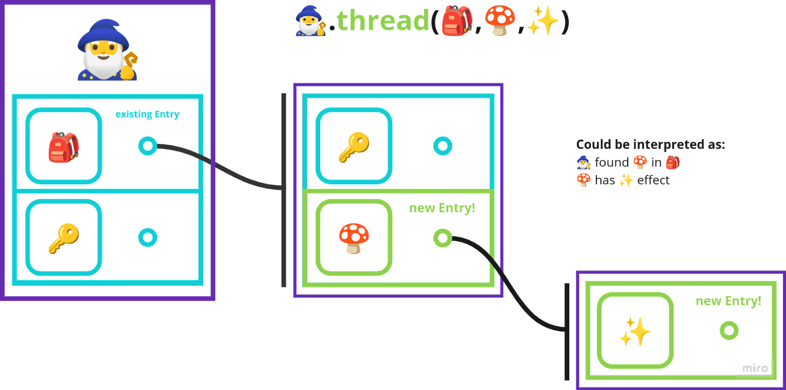
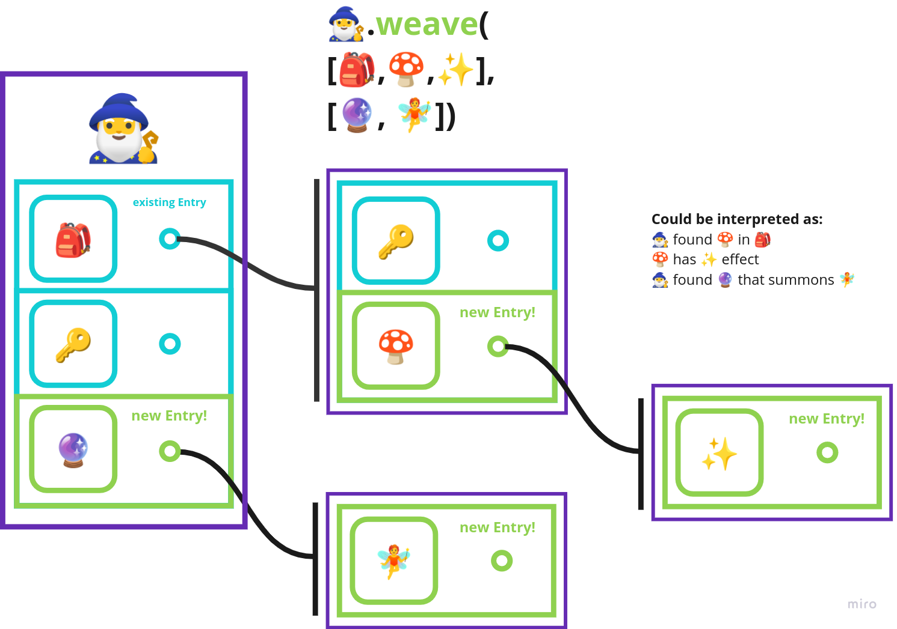
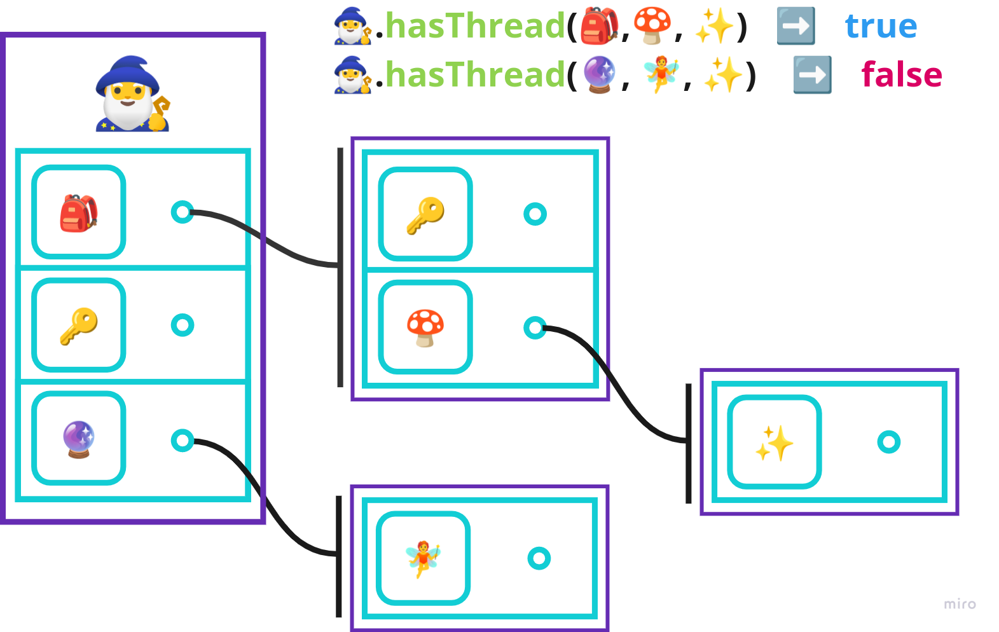
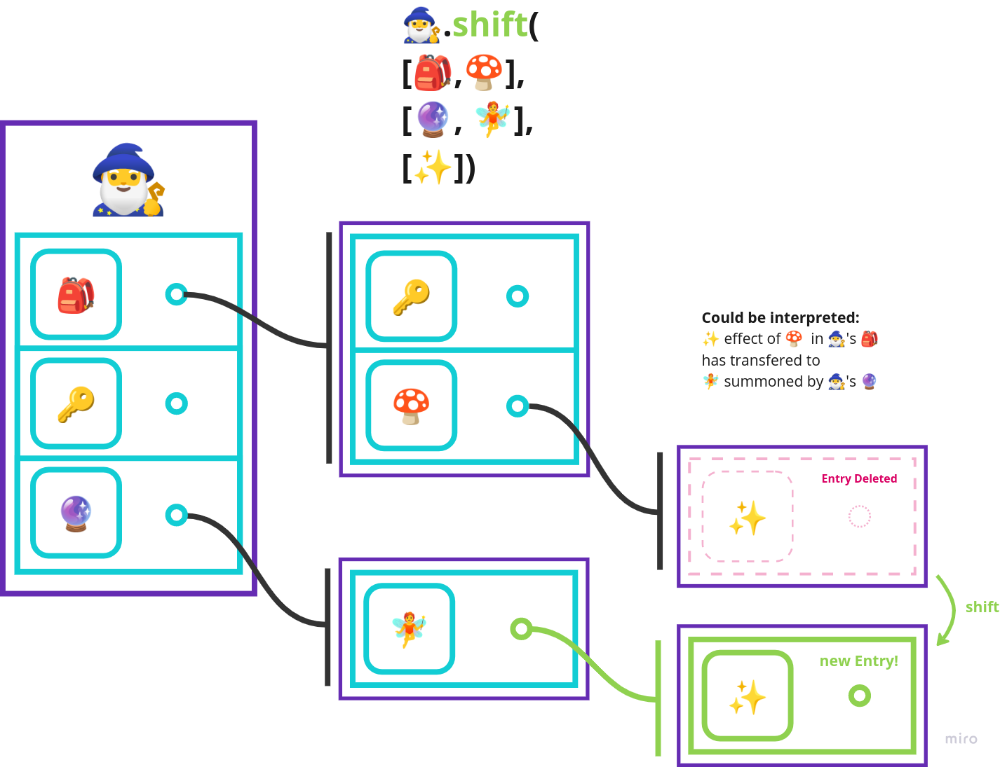
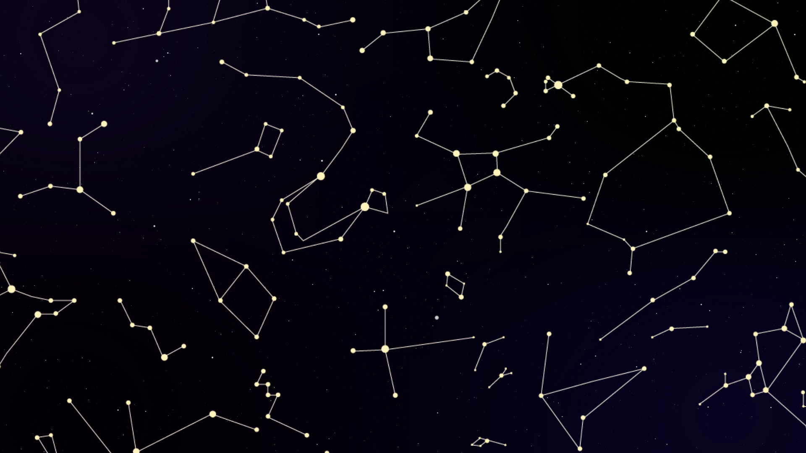
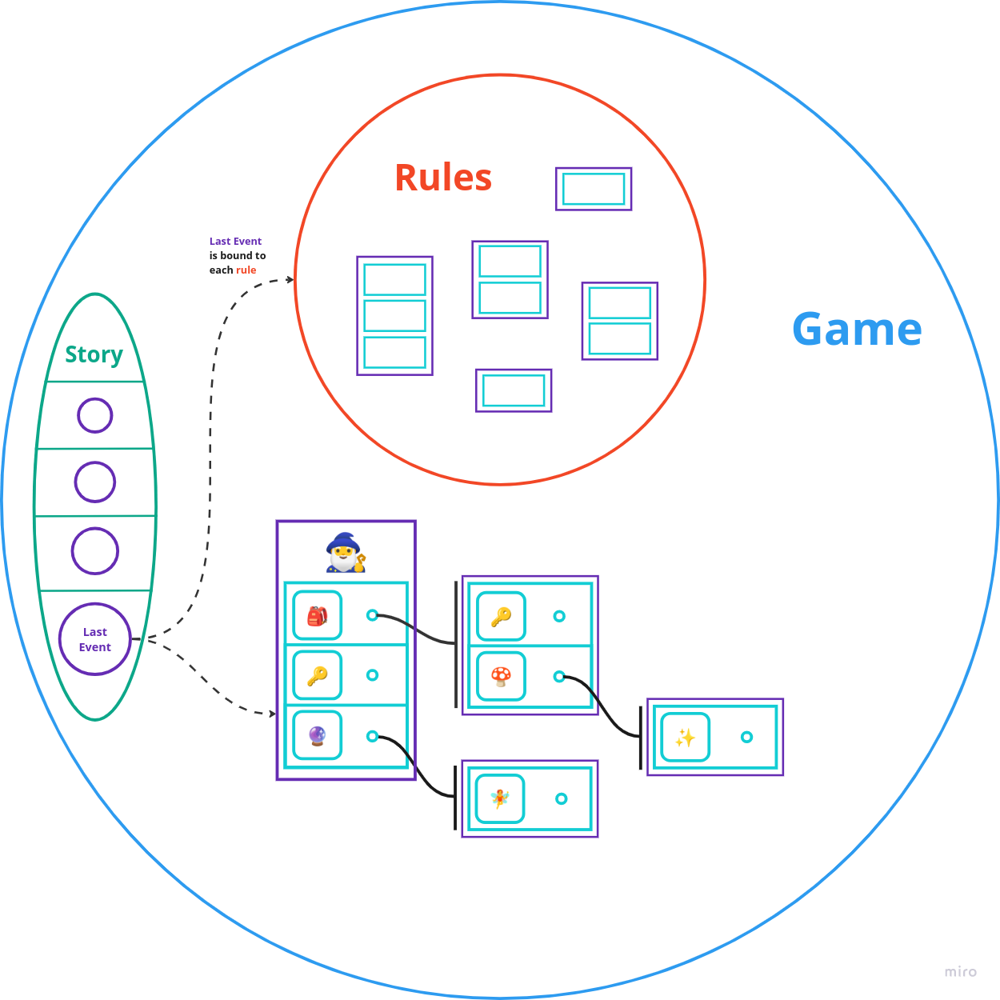

# Play!

**Play!** is a new media, it's an **interfacing interface 🎛️🔁🎛️**.

**Music** 🎵 has at its disposal duration of time ⏳.

**Painting** 🎨 can present to the viewer the whole content of its message at one moment 🖼️.

**Movie** 🎥 attempted a synthesis of **music** 🎵 and **painting** 🎨  but lacked in *mutability* and *extensiveness*, *receptivity* and *interactivity*.

Indeed for what the **movie** 🎥 itself lacked in *receptivity* and *mutability* it demanded of the viewer 👀, and the injunction of this medium can be summarized as ***Watch!*** 👁️

**Interface** 🎛️ has always represented a partial inverson of the **movie-viewer** 🎥👀 relation adding *mutability, extensiveness, receptivity* and *interactivity* to the thing in view.

**Social-interface** 🌐👥 brought *sociality* to the *mutability, extensiveness, receptivity,* and *interactivity* of the **interface** 🎛️ in ways defined by the affordances of the particular **interface**.

**Interfacing interface** 🎛️🔁🎛️ brings *mutability*, *extensiveness*, *interactivity*, *receptivity* to the architecture/frame of **interface** itself through **interface** itself. The injunction of this medium is ***Play!***

*(Add note on a language as interfacing interfacing)* 📝🔄🎛️

Play! as an **Interfacing interface** 🎛️🔁🎛️ takes the inherent properties of **music** 🎵, **painting** 🖼️, **movie** 🎥, **interface** 🎛️, and **social-interface** 🌐👥 to create a new and evolved media format that leverages the different aspects of each media form while overcoming their individual limitations.

The keyword here is ***"Play!"*** It's not just about watching or listening passively. Instead, it's about active participation, experimentation, and discovery, much like playing a game. *With **Play!**, the interface is the playground, the medium, and the message, all at once.*

**[Play! (telegram)](https://t.me/semioverse)**[ 💬🎭](https://t.me/semioverse)

---

# Oxels!

Oxels are **Organizational Elements**. The name originates from and has been heavily explored at the experimental organizations collective **[Xorg](https://xorg.how)** 🚀🧑‍🔬. While this repository only represents one branch of what Oxels can be, framing it in this way has been conducive to creative thinking 💡🎨.

In the context of this program, Oxels are a transformative data structure that revolutionizes the way we compose, weave, program, and interpret networks of relationships. An Oxel is not just a node; it's a perspective, a point of view within a semio-dimensional relational graph. It can hold any data type, even other Oxels, enabling intricate and dynamic interconnections.

Oxels come alive with their metaphoric capabilities allowing us to make metaphorical jumps across seemingly disparate concepts. When navigating a network, Oxels can trace the metaphoric pathways that bind them. This mirrors human cognition, turning Oxels into a playground for computational creativity. Oxels are both a vessel to navigate the semioverse, as well as that which makes up its structure 🚢🧩🌐.

Oxels are more than a data structure. They're a semiotic game element, a tool for modeling and navigating interconnected and unfolding concepts and relationships. Whether you're crafting a game, exploring a social network, or constructing a semio-dimensional grammar, the Oxel is your key 🔑 to unlocking new depths of understanding and connection. Oxels effectively allow us to move beyond the linearity of the literary form itself! Welcome to the Semioverse, where Oxels are the language and the landscape!

---

# What? That sounds crazy! What do they do exactly? 🤔🧩

The Oxel class extends JavaScript's built-in Map class thus preserving the insertion order of key-value pairs, where **keys and values can be of any type including other Oxel instances**. This creates a network of iterable sets of associations/relationships that are the key-value pairs of each Oxel.

The Oxel class includes methods such as thread, weave, navigate, and swap, each functionally representing different components of meaning and facilitating the creation, navigation, and transformation of Oxel-graphs.

**Constructor 🏗️:** It accepts four parameters `name`, `ruleEngine`, and `...args`. The `ruleEngine` is an optional async function that defaults to a function returning `true`. *(These parameters simply aid development and are not recommended when compared to the advantages of reference-weaving)*

`name` is properties of the Oxel object, while `positions` is a Set object for storing references to the positions of this Oxel in other Oxels. `expressions` stores expressions about this Oxel. `ruleEngine` is a mechanism to verify each action made on the Oxel object.

```javascript
const player = new Oxel("scenes")
const scenes = new Oxel("scenes");
const roles = new Oxel("roles");
const moves = new Oxel("moves");
```

**thread 🧵:** The thread method adds each input path as a key 🔑 within the current Oxel and gets the value of that key, traversing the graph to the next Oxel if it exists (creating a new Oxel otherwise) which becomes the current Oxel. This repeats till all paths have been added and traversed.

```javascript
player.thread(scenes, roles, moves)
```



**weave 🕸️:** The weave method utilizes the thread method to weave several threads, much like weaving a tapestry.

```javascript
player.weave(
[scenes, roles, moves]
[scenes, roles, moves]
[scenes, roles, moves])
```



**hasThread 🧵:** This method can help to check if a particular thread exists within an Oxel, and it could be used for checking conditions in gameplay rules.



**shift 🔄:** The `shift` method is used to move a 🔑 key-value pair from one position in the Oxel-graph to another. It takes two routes as input, navigates to the end of the first route, removes the key-value pair located there, then navigates to the end of the second route and inserts the removed key-value pair at that location.

```javascript
players.shift([player1, roles, chef], [player2, roles])
```



In terms of game design, the `shift` method could be used to transfer roles, objects, or other properties between different parts of the game state. For example, it could be used to move a player from one scene to another, to pass an element from one character to another, or to move something from potentiality to actuality.

**swap 🔄:** This method is used to replace a value at the given key 🔑 in a `Oxel` or `Map` structure at the end of each given route. The `swap` method will replace the key-value pair at the end of the route. The original key-value pair that was replaced is yielded back to the caller.

**navigate 🧭:** This method is for navigating through the Oxel's structure based on paths or a generator object. It respects the `ruleEngine` and follows the paths provided, keeping track of `currentOxel` and `previousOxel` in the `positions` set, effectively allowing for bi-directional navigation. If it encounters the reserved keyword `"metaphor-dive"`, it looks ahead one path and goes deeper if possible. It yields an object containing `previousOxel`, `pathTaken`, and `currentOxel`.

```javascript
player.navigate(scenes, roles, moves)
```

**snapshot 📸:** This method is used to create a snapshot of the current state of the `Oxel` structure up to a specified depth. It first checks if the operation is allowed by the `ruleEngine`, then creates a deep copy of the current `Oxel` up to the provided depth, and lastly freezes the copied structure to prevent mutation. The snapshot method has many uses including allowing players to capture the *state-of-play* in order to undo moves or to provide *proofs of state* 🧩📸🔐.

What emerges from the methods introduced so far is a dynamic system of meaning where individual units (Oxels) are linked through paths (thread 🧵), creating a network (weave 🕸️) that can be explored (navigate 🧭) and transformed (shift/swap 🔄).

*(note that in the future we want to make all methods and properties oxels themselves that are woven, and use the oxel-based interpreter)*

# Oxels as perspectives 👁️🧩

**Interestingly the structure created by threading/weaving oxels embodies the concept of perception 👁️.** For example, imagine constructing oxels to symbolize all individuals populating your life-world, yourself included 👥🌍🧩.

You would embark on a process of threading from yourself to others:

```javascript
self.thread(relation, otherperson1, relation, otherperson2, ...etc). 
```

Yet, this thread does not record a *direct* relationship between two individuals. **Instead, the relationship is mediated, emerging from the self as the root 👁️🔀🧩.**

Within the self's graph, you can discern the relationships between yourself and others, as well as the relationships amongst others. *However, the constellation of relationships exists on a horizon of meaning extending from the self, and the same constellations (all else remaining constant) don't necessarily extend from the other.*

If you tried to explore `otherperson.keys()`, you would find that no relations have yet been formed on the otherperson's graph. **This means that every oxel can be considered a perspective/point of view of a relational graph.**

*(every oxel is a master-signifier that organizes a constellation of meaning)*

When we draw constellations in the sky, they are lines we draw from our point of view, but we are not actually saying that the stars are *in-themselves organized by these very lines, and indeed many cultures have organized the stars into totally different constellations 🌌🔀🧩...*

```javascript
constellations.weave(
[star1, star2, star3, star1],
[star6, star1, star5, star6],
[star7, star8, star9, star2])
```



## Metaphor 🦉

A metaphor involves using a signifier from one symbolic constellation to represent something in another constellation. Metaphors can bridge gaps between disparate concepts, making unfamiliar ideas more relatable and understandable. Using Oxel instances as keys 🔑 essentially enables the system to function on multiple levels of abstraction simultaneously.

Because the Oxel class extends the Map class allowing for keys and values to be of any type, keys 🔑 can themselves be Oxel instances. By permitting keys to be Oxel instances rather than simple identifiers (of type string/symbol), the system allows for metaphorical connections to be made.

Using Oxel instances as keys 🔑 - signifying metaphor - adds a degree of conceptual abstraction that makes this system incredibly powerful for bridging gaps between disparate systems or concepts.

## Metaphor-dive during Navigation

When the navigation method encounters the "metaphor-dive" token, it performs a jump from one concept to another related concept - not by a direct link, but via an intermediate implicitly metaphorical relationship

When the navigation method encounters the "metaphor-dive" token, it traverses into the oxel that is being used as a key 🔑 in the current oxel. Rather than traversing the “metonymic axis” of language the “metaphor-dive” allows for traversals across the “metaphoric axis” of language. A metonymic thread can then consist entirely of metaphors.

This mirrors the way human cognition often works: we constantly make connections between seemingly unrelated concepts based on their shared properties or associated ideas. For example, the word 'network' has been borrowed from its original physical sense (a net-like structure 🕸️) to describe social and computer systems.

With metaphor-dive, Oxel-graphs can support more sophisticated forms of reasoning, including analogical and metaphorical thinking. It can enable a form of computational creativity, where new connections between concepts are generated dynamically based on their metaphorical relationships. By combining direct (literal) and indirect (metaphorical) relationships, the Oxel-graph can evolve and expand in a more organic and dynamic way, closely mirroring the way human knowledge grows.

# Interpretation

The interpreter starts by looking at the root of the graph. It then traverses the graph according to the "grammar" encoded in the keys ("parameters", "functionBlock", "if-else", "condition", etc.). Each key tells the interpreter what to do next: gather parameters, evaluate a condition, and so on.

In this sense, the keys 🔑 of each oxel, can be their own oxel-graphs that can be interpreted as *schemas* or Abstract Semantic Graphs that help the interpreter understand what each of the nodes in value-graph represents by associating them with their iteratively correspondent node in the key-graph.



Each of these structures might have a corresponding interpretation rule-oxel in the interpreter, effectively creating a language of oxels. This enables not just data, but also operations, control flows, and functions to be represented and manipulated as oxels themselves.

While traversing through this oxel-graph, the interpreter would parse the keys 🔑 and values, interpreting them based on their role. For example, when it comes across the 'if-else' key-oxel, it knows to evaluate the 'condition' oxel in the value and branch accordingly. Similarly, 'return' key-oxel would indicate a return statement, and its value would be the return value.

**Because the interpreters rule-oxels are themselves oxel-graphs that are interpreted through this same process, we obtain a meta-circular and homoiconic interface, programming language, and data structure.**

The meta-circularity and homoiconicity allow for oxels to be incredibly expressive and dynamic. You can create new operations, alter existing ones, or change the control flow entirely, all within the structure of the oxels themselves. In other words, the oxels and their relationships are both the structure and the manipulation of the structure. This dynamic nature opens up a vast potential for complex, self-modifying, and self-adaptive systems.

And because each Oxel forms a graph rooted at itself, oxels can represent not just objects, but entire worlds of objects, each with their own relationships and rules. This encapsulation allows for multiple "perspectives" to exist simultaneously within the same oxel structure, with each perspective being a possible interpretation of the structure.

Oxels make it possible to capture not just the "what" of data, but also the "how" and "why". And because these perspectives are all interconnected within the oxel structure, changes to one perspective imminantly propagate across the reference-graph. This makes oxels a powerful tool for modeling complex systems and processes, and for understanding how different aspects of a system influence each other.

But perhaps the most exciting thing about oxels is that they are not limited to representing existing concepts and relationships. Because oxels can be combined and recombined in endless ways, they are also a powerful tool for creating new concepts and discovering new relationships.

In a sense, oxels are a language for thought itself – a language that not only describes the world, but also helps us to reshape it. So go ahead, dive into the world of oxels and start weaving your own constellations of meaning!

# Semio-dimensional Grammars 📖🔀🧩

*This section would make absurdly huge claims, and the proposed parse/fuse function is not yet satisfactorily implemented, so this section has been left out of this readme and included in this Github Issue: https://github.com/semioverse/semioverse/issues/2* 📝

---

# Beyond the Literary Form

Turing machines, and by extension many traditional computational models, are based on sequential processing and linear structure which to a certain extent are based on the linear-literary form. They typically process data in a step-by-step manner, often following a specific sequence of operations or instructions. This mirrors the linear, sequential nature of language and literature, where sentences are read one word at a time and in a particular order.

A Turing machine reads one symbol at a time from its tape and follows a set of rules to determine what actions to take based on that symbol. In contrast, Oxels can potentially recognize complex patterns or structures in the data, not just individual symbols. This can be likened to understanding the meaning of an entire paragraph or chapter at once, rather than processing it word by word.

# Imminant non-locality of meaning

Since modifications of the reference structures in the graph change the meaning of references is inherently non-local since it is a "form" or "shape" of the reference patterns and pattern references that give them their meaning. Thus by changing the form we imminently altering meaning across the totality of the connected graph, because the “form” is simply different. Interestingly, this doesn’t require the use of event-propogation, the change of form is simply *imminant*.

Indeed, in a complex system like the Oxel-based cognitive landscape, the slightest change in the reference structure can lead to significant shifts in the meaning of individual Oxels, a phenomenon known as non-locality. This can be seen as a manifestation of a foundational principle in graph theory, where nodes (or in this case, Oxels) do not hold meaning in isolation but are defined by their relationships to other nodes.

Non-locality in reference structures is comparable to a three-dimensional puzzle or an intricately woven tapestry. Each piece or thread does not have inherent meaning on its own; rather, it contributes to the collective form, pattern, and overall image. If you alter one piece of the puzzle or one thread in the tapestry, the entire image changes, albeit subtly.

In an oxel-graph (reference-graph), changing a single reference can propagate changes throughout the system, akin to a ripple effect. This is because the change doesn't just affect that particular reference; it recontextualizes all the Oxels connected to it. In this way, meaning is a dynamic, emergent property of the entire system rather than a static attribute of individual components.

This brings us to another aspect of non-locality: the notion of a higher-dimensional cognitive space. Just as a two-dimensional map is a projection of a three-dimensional landscape, our cognitive map is a projection of a higher-dimensional cognitive space. When we modify the reference structures, we're essentially reshaping this higher-dimensional space, leading to a new projection, a new cognitive map.

In this perspective, meaning is not just the sum of individual references but the synthetic product of a unified whole. It's a dance of shapes and patterns that continually evolves, forming and reforming the tapestry of our understanding.

# Meta-linguistic Assertions

"The **role** A plays in **scene** X is functionally pragmatically equivalent (scalar correlation) to the **role** B plays in **scene** Y."
*(This kind of statement can be explicit or implicit in parsing: see semio-dimensional grammars)*

---

# Contributing to this repo! 🤝🧩

**Join the [Play! (telegram)](https://t.me/semioverse) we have weekly gatherings for casting semioversal magic!** *Bring your dreams and visions and lets weave interfaces for them!* 🎭🌍🎲💬

## [🚀 Sponsor Play!](https://slice.so/slicer/play)

Feeling generous? 🎁 Spark more fun by sponsoring Play! through the link above or light up our day by sending some `ETH` love to the slicer's address: `0xd481a2d3ca2d4fa1f061e3ba10431fb4f38d92a5`

## Merge to Earn 💰🔄🧩

This repository uses [Merge to Earn](https://mte.slice.so/) to reward contributors with a piece 🍰 of the [Play! slicer](https://slice.so/slicer/play).

It enables a transparent, equitable reward system for collaborative and open-source development.

When merging a pull request, contributors **can receive an agreed number of slices (ERC1155 tokens) representing ownership over the earnings of the Play! slicer.**

> Curious cat? 😸 Peek into the magic with this [Demo PR](https://github.com/slice-so/merge-to-earn/pull/4)

Funds earned can be claimed anytime on [slice.so](https://slice.so) while slices can be transferred and managed from either the Slice website or directly from your ETH wallet.

You can also buy and sell your slices on [OpenSea](https://opensea.io/assets/ethereum/0x21da1b084175f95285B49b22C018889c45E1820d/37)!

**🎨🎭🎤 Not just a coding wizard 🧙‍♂️? Check out [Play Labs](https://github.com/semioverse/semioverse/tree/master/labs) for instructions on how to sprinkle your unique magic and claim your prize! 🌟🗺️🎪**

Disclaimer: *Shares of the Play! slicer do not represent shares of ownership over Play! in any form, rather they represent only shares of the tokens that pass through the slicer.

---

*This document is a living artifact and may evolve with the growth and exploration of the community. The contents, concepts, and vision here are not set in stone but are a launchpad for continued innovation and exploration. Together, we will shape the future of Play!, Oxels, and beyond!* 🚀🧩🌌
